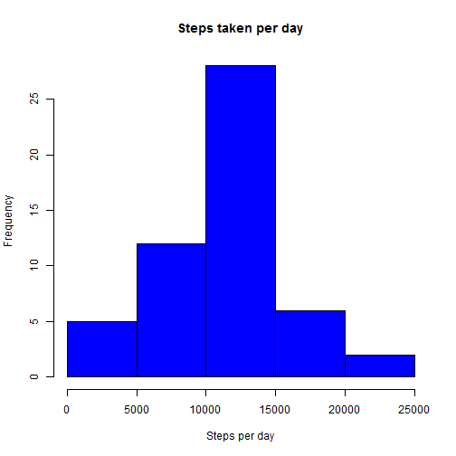
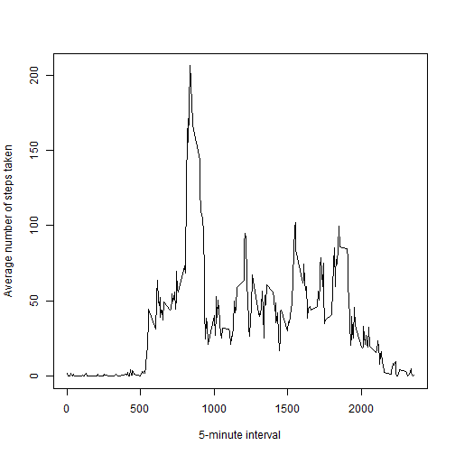
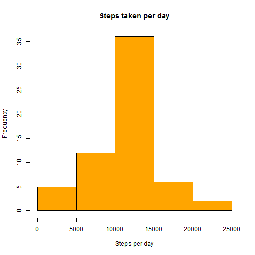
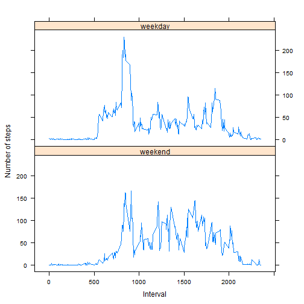

In this assessment we use data from a personal activity monitoring device to 
answer some questions about performance and behaviour. 


## Loading and preprocessing the data

This step unzip the data file, read it and transform the "date" variable.


```r
unzip("activity.zip")
data <- read.csv("activity.csv", stringsAsFactors=FALSE)
data$date <- as.Date(data$date)
```

## What is mean total number of steps taken per day?

Now, first the data is grouped by date (using plyr library), and then a 
histogram is plotted.


```r
library(plyr)
dataByDate <-ddply(data, ~date, summarise, stepsPerDay=sum(steps))
with(dataByDate, hist(stepsPerDay, col="blue", main="Steps taken per day", 
                xlab="Steps per day"))
```

 

The mean of steps taken by day is:


```r
mean(dataByDate$stepsPerDay, na.rm=TRUE)
```

```
## [1] 10766.19
```

And the median is:


```r
median(dataByDate$stepsPerDay, na.rm=TRUE)
```

```
## [1] 10765
```

## What is the average daily activity pattern?

To identify the activity pattern, the data is grouped by interval
(using plyr library), and then a line chart is plotted.


```r
dataByInterval <-ddply(data, ~interval, summarise, avgSteps=mean(steps, na.rm=TRUE))
with(dataByInterval, plot(interval, avgSteps, type="l", 
                ylab="Average number of steps taken", xlab="5-minute interval"))
```

 

The interval with maximum steps is:


```r
maxInterval <- dataByInterval[which.max(dataByInterval$avgSteps), ]$interval
sprintf("%s which represents the %02i:%02i time format", maxInterval,
        maxInterval%/%100, maxInterval%%100)
```

```
## [1] "835 which represents the 08:35 time format"
```

## Imputing missing values

The dataset contains some NA rows, cases where data was not collected.
The amount of cases with some missing value is:


```r
sum(!complete.cases(data$date, data$interval, data$steps))
```

```
## [1] 2304
```

As the whole day is empty, it's a better idea consider the interval mean 
to update/fill missing data.

To support the update process, the data.table package was used.


```r
library(data.table)
```

```
## data.table 1.9.4  For help type: ?data.table
## *** NB: by=.EACHI is now explicit. See README to restore previous behaviour.
```

```r
dt <- data.table(data)
dt[, meanStepsByInterval:=mean(steps, na.rm=TRUE), by=interval]
```

```
##        steps       date interval meanStepsByInterval
##     1:    NA 2012-10-01        0           1.7169811
##     2:    NA 2012-10-01        5           0.3396226
##     3:    NA 2012-10-01       10           0.1320755
##     4:    NA 2012-10-01       15           0.1509434
##     5:    NA 2012-10-01       20           0.0754717
##    ---                                              
## 17564:    NA 2012-11-30     2335           4.6981132
## 17565:    NA 2012-11-30     2340           3.3018868
## 17566:    NA 2012-11-30     2345           0.6415094
## 17567:    NA 2012-11-30     2350           0.2264151
## 17568:    NA 2012-11-30     2355           1.0754717
```

```r
dt[is.na(steps),]$steps <- as.integer(dt[is.na(steps),]$meanStepsByInterval)
filledData <- data.frame(dt[, 1:3, with=FALSE])
```

After the treatment of data, a new histogram is plotted again (grouped by date):


```r
filledByDate <-ddply(filledData, ~date, summarise, stepsPerDay=sum(steps))
with(filledByDate, hist(stepsPerDay, col="orange", main="Steps taken per day", 
                xlab="Steps per day"))
```

 

The "new" mean is:


```r
mean(filledByDate$stepsPerDay)
```

```
## [1] 10749.77
```

And the "new" meadian is:


```r
median(filledByDate$stepsPerDay)
```

```
## [1] 10641
```

As you can see, there's no large difference before and after the data treatment.
But, depending on the strategy to update data and amount of NA's rows, the noisy
could impact much more the results.

## Are there differences in activity patterns between weekdays and weekends?

To check if there's differences between weekdays and weekends, a factor variable
(named "type") is created, the result is grouped by type/interval and a new
line chart is plotted showing some pattern inequality.


```r
library(lattice)
filledData$type <- factor(weekdays(filledData$date))
levels(filledData$type) <- list (
  weekend = c("Saturday", "Sunday"),
  weekday = c("Monday", "Tuesday", "Wednesday", "Thursday", "Friday")
)
filledByType <-ddply(filledData, .(type, interval), summarise, 
                     avgSteps=mean(steps, na.rm=TRUE))
with(filledByType, xyplot(avgSteps ~ interval | type, layout = c(1,2), type="l",
                          xlab="Interval", ylab="Number of steps"))
```

 
